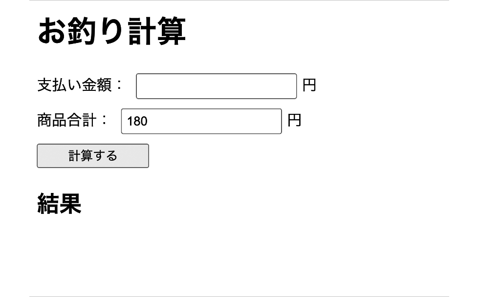

# jsQuiz-neo-02

「関数の作り方」の振り返りです。

## 課題内容

下記の「見本」のように、**支払い金額**を入力してボタンを押すと、お釣りの金額を表示する JavaScript を書いてください。
**商品合計は HTML 側で `180` 円に固定されています**（`#total` の `value="180"`）。



### 作成する関数

```js
calcChange(payment)
```

- 引数: 支払い金額 `payment`（数値）
- 戻り値: お釣り（`payment - 180`）の**数値**
- 関数の中で `#total` の値を `Number()` で取得して使ってください
- **重要**: グローバル（`$(function(){})` の外）に定義してください

### ボタンクリック時の表示

`calcChange` の戻り値を使って、`.result` に以下を表示します：

```
お釣りは〇〇円です
```

### 採点例

- 支払い 200円 → `お釣りは20円です`
- 支払い 500円 → `お釣りは320円です`
- 支払い 1000円 → `お釣りは820円です`

---

## 制作手順（ヒント）

1. グローバル（`$(function(){})` の外）に `calcChange(payment)` を定義
2. 関数の中で `#total` の value を `Number()` で数値化して取得
3. `return payment - total;` で差額を返す
4. ボタンクリック時に：
   - `#payment` の値を取得
   - `calcChange` を呼び出して変数に代入
   - `.result` に `お釣りは〇〇円です` の形式で書き込む

---

## 提出方法

### ① Fork
このリポジトリを自分のアカウントに Fork してください。

### ② clone
自分の Fork を GitHub Desktop で clone します。

### ③ branch を作る
ブランチ名に「quiz2/自分の名前」を記入する（例：quiz2/kawaguchi）

### ④ コードを書く
`students/{自分の番号}/index.html` を編集して課題を完成させます。
（例：出席番号が 7 番なら `students/7/index.html`）

ルートの `index.html` を `students/{自分の番号}/index.html` にコピーしてから編集するのが簡単です。

### ⑤ commit / push
変更を commit して push してください。
- title：出席番号 名前
- message：提出します。

### ⑥ Pull Request を作成
元のリポジトリに向けて Pull Request を作成してください。

## 判定について

- Pull Request を出すと自動判定が実行されます
- 成功 → ✅ **合格！** のコメントが付きます
- 失敗 → ❌ **不合格** のコメントと確認ポイントが付きます

結果は PR のコメント欄と「Checks」タブで確認してください。

## ディレクトリ構成

```
jsQuiz-neo-02/
├── index.html              # 問題ファイル（参照・複製元）
├── sample.gif              # 完成イメージ
├── students/               # 解答フォルダ ★ここに作業する
│   └── {自分の番号}/
│       └── index.html      # index.html を複製して解答を記述
├── .github/                # 自動判定の設定（触らない）
├── tests/                  # 自動判定の設定（触らない）
├── playwright.config.js    # 自動判定の設定（触らない）
└── README.md
```

## 注意

- `students/{自分の番号}/index.html` の `<script>` 内だけ編集してください
- HTML構造（`#payment`, `#total`, `button`, `.result`）は変えないでください
- `#total` の `value="180"` はそのままにしてください
- `calcChange` 関数は**グローバル**に定義してください（`$(function(){})` の外）
- `students/` 以外のファイルは変更しないでください
- エラーが出たら修正して再度 push してください

---

## 模範解答

授業資料の一番下に、リンクがあります。
